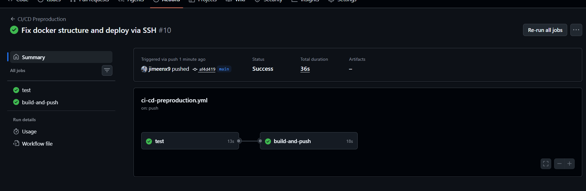
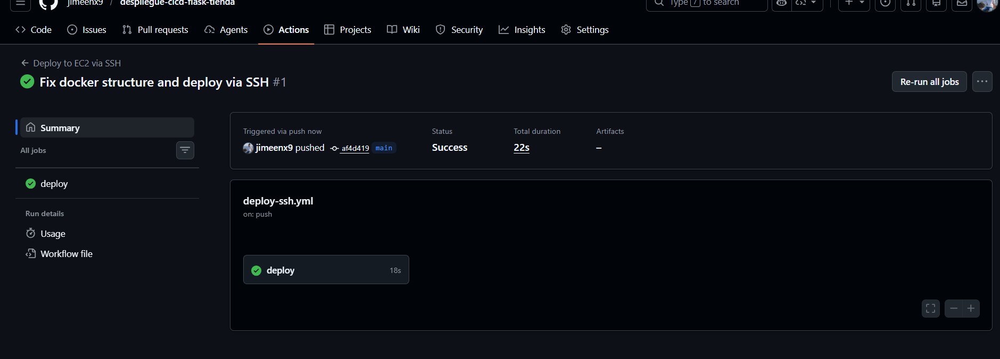
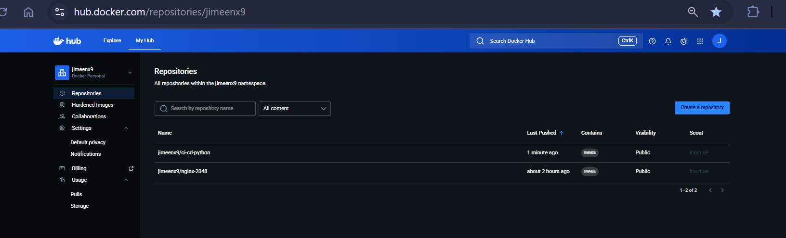
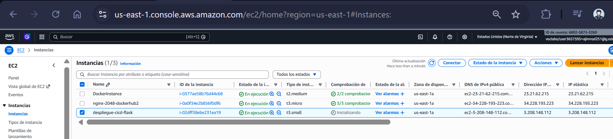
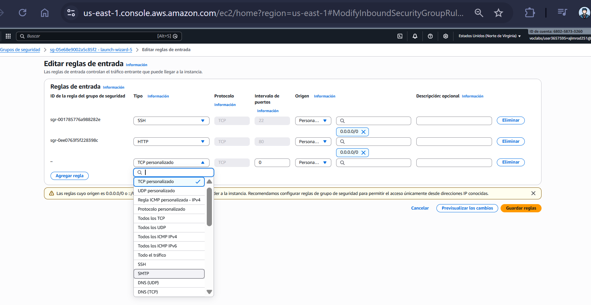
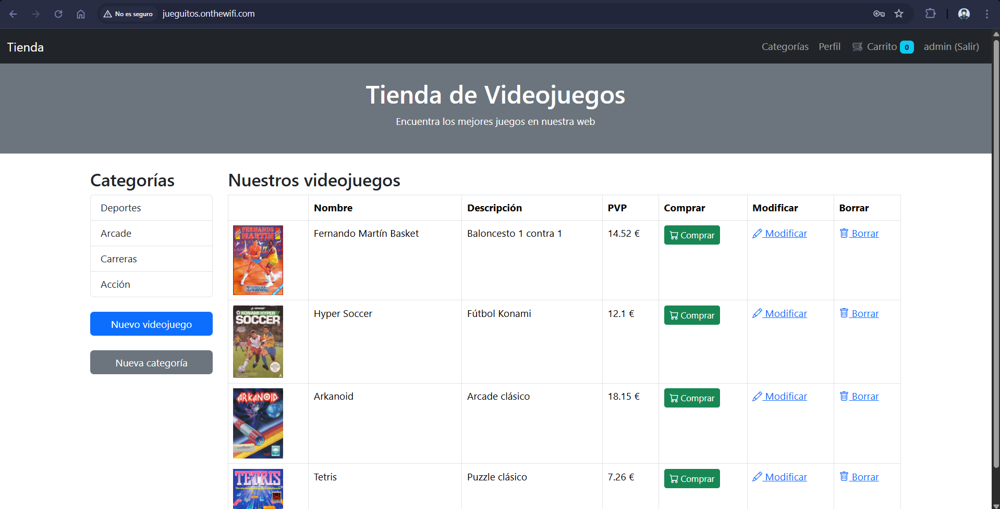
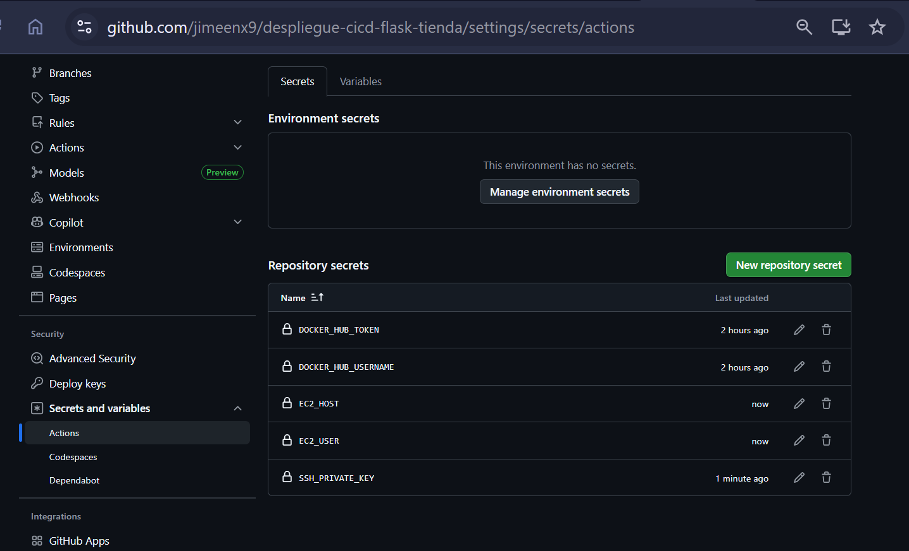

# 🚀 Despliegue CI/CD de una aplicación Flask en AWS usando Docker y GitHub Actions

---

## 🧑‍🎓 Información

- **Alumno:** Alberto Jiménez
- **Curso:** 2º DAW — 2025/2026
- **Módulo:** Despliegue de Aplicaciones Web
- **Profesor:** José Juan Sánchez
- **Centro:** IES Celia Viñas

---

## 🎯 Objetivo

El objetivo de esta práctica es implementar un flujo completo **CI/CD real** para una aplicación web desarrollada en **Flask**, automatizando todo el proceso desde el desarrollo hasta la puesta en producción.

El sistema permitirá que, cada vez que el desarrollador realice un `git push` al repositorio:

1. Se ejecuten automáticamente los tests de la aplicación (**Integración Continua**)
2. Se construya una nueva imagen Docker (**Entrega Continua**)
3. Se publique en Docker Hub (**Versionado automático**)
4. Se despliegue automáticamente en un servidor AWS EC2 (**Despliegue Continuo**)

El resultado final es una aplicación accesible públicamente desde Internet sin intervención manual del desarrollador.

---

## 🧠 Arquitectura del sistema

El despliegue implementa una arquitectura basada en automatización DevOps:

```bash
Desarrollador
     │
     │ git push
     ▼
GitHub Repository
     │
     ▼
GitHub Actions (CI)- Ejecuta tests- Construye imagen Docker
     │
     ▼
Docker Hub (Registry)- Guarda versión única por commit (SHA)
     │
     ▼
GitHub Actions (CD)- Conexión SSH segura
     │
     ▼
Servidor AWS EC2- Descarga nueva imagen- Reemplaza contenedor en ejecución
     │
     ▼
Docker Container- Ejecuta aplicación Flask
     │
     ▼
Usuario final (Internet)
```

Este sistema implementa un despliegue completamente automatizado:

el servidor nunca recibe código fuente, únicamente ejecuta la imagen generada por el pipeline.


---
## ⚙️ Características clave del despliegue

El despliegue implementado sigue un flujo **DevOps real**, donde la infraestructura no depende de copiar archivos manualmente al servidor, sino de reconstruir el sistema automáticamente a partir del código fuente.

Principios aplicados:

- Infraestructura inmutable → nunca se modifica el servidor manualmente
- Despliegue por imagen → el servidor solo ejecuta contenedores
- Automatización total → no existe intervención humana tras el push
- Versionado → cada despliegue corresponde a un commit concreto
- Reproducibilidad → el servidor puede destruirse y reconstruirse en minutos

Esto convierte el servidor en un simple **runtime de contenedores**, no en un entorno de desarrollo.

---

## 🔄 Flujo completo CI/CD

1. El desarrollador realiza cambios en la aplicación Flask
2. Hace `git push` a la rama `main`
3. GitHub Actions ejecuta los tests automáticamente
4. Si pasan, se construye la imagen Docker
5. Se publica en Docker Hub con el SHA del commit
6. GitHub Actions se conecta por SSH al servidor EC2
7. Se elimina el contenedor antiguo
8. Se descarga la nueva imagen
9. Se levanta el nuevo contenedor
10. La web queda actualizada automáticamente

---

### Ejecución automática del workflow

**Pestaña *Actions* mostrando test + build + deploy en verde** 






---

## 🐳 Versionado de imágenes Docker

Cada despliegue genera una imagen única identificada por el hash del commit:

```
usuario/ci-cd-python:<SHA>
usuario/ci-cd-python:latest
```

Esto permite:

- Volver atrás a versiones anteriores
- Saber exactamente qué código está en producción
- Evitar inconsistencias entre servidor y repositorio

**Repositorio en Docker Hub mostrando múltiples versiones**




---

## ☁️ Servidor en AWS EC2

El servidor no contiene código fuente ni repositorios clonados.

Solo tiene:

- Ubuntu
- Docker
- Puertos abiertos
- Acceso SSH

La aplicación vive dentro del contenedor.

**Lista de instancias EC2** 



---

### Reglas de seguridad

Se permiten únicamente los puertos necesarios:

- 22 → administración remota
- 80 → acceso web público

**Reglas de entrada del Security Group** 



---

## 🌍 Dominio público

Se configuró un dominio dinámico que apunta a la IP pública del servidor.

```
jueguitos.onthewifi.com
```

**Navegador mostrando la web desde el dominio** 



---

## 🔐 Secrets utilizados

Para evitar exponer credenciales en el repositorio se utilizaron secretos de GitHub:

- `DOCKER_HUB_USERNAME`
- `DOCKER_HUB_TOKEN`
- `EC2_HOST`
- `EC2_USER`
- `SSH_PRIVATE_KEY`

**Pantalla de Secrets en GitHub** 



---

## 🧩 Despliegue automático

GitHub no utiliza la API de AWS.

El despliegue se realiza conectándose por SSH al servidor y ejecutando comandos Docker:

- Detener contenedor anterior
- Descargar nueva imagen
- Arrancar nueva versión

Esto simula el funcionamiento de muchos entornos profesionales donde el servidor es un nodo Docker gestionado remotamente.


---

## 🧠 Persistencia del sistema

El servidor puede apagarse y encenderse sin perder la aplicación.

El contenedor se vuelve a iniciar automáticamente porque Docker mantiene su configuración.

Sin embargo:

- La base de datos vive dentro del contenedor
- Cada nueva imagen recrea el estado inicial

Esto corresponde a un modelo **stateless deployment**, típico en arquitecturas cloud.

---

## 📦 Resultado final

El sistema permite desplegar una nueva versión simplemente ejecutando:

```bash
git add .
git commit -m"Nueva version"
git push
```

Sin acceder al servidor.

Tras unos segundos la web queda actualizada automáticamente.

---

## 🧠 Conclusión

Se ha implementado un pipeline DevOps completo equivalente a un entorno profesional:

- Integración continua
- Entrega continua
- Despliegue continuo
- Infraestructura reproducible
- Versionado de aplicación
- Acceso público por dominio

El servidor deja de ser una máquina manual y pasa a ser un **ejecutor automático de contenedores**, donde el código es la única fuente de verdad.

## 📚 Referencias

- https://aws.amazon.com/ec2/
- https://josejuansanchez.org/iaw/

---


© 2026 — Práctica realizada por **Alberto Jiménez**